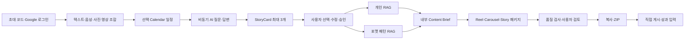

# 스토리로그 제품 기획 기준

- 제품명: 스토리로그(가칭)
- 기준일: 2026-08-16
- 문서 상태: MVP v1 확정
- 첫 고객: 한국어로 활동하는 AI·테크 예비 크리에이터
- 대표 포맷: Instagram Reel
- 제공 포맷: Reel·Carousel 게시물·Story 제작 패키지
- 목적: 서비스 방향, 사용자 흐름, AI/RAG 경계, MVP 범위와 4주 베타 검증 기준을 정의한다.
- 전제: 시장·사용자·성과에 관한 내용은 가설이며 사용자 인터뷰와 실제 사용 데이터로 검증한다.

## 1. 서비스 정의

스토리로그는 사용자가 텍스트·음성·사진·영상을 원하는 조합으로 남기고, 필요하면 선택한 Google Calendar 일정과 비동기 AI 질문으로 맥락을 보완하면, 실제 경험을 Instagram Reel·Carousel 게시물·Story 제작 패키지로 바꾸는 AI 기록·콘텐츠 워크플로우다.

> **나의 하루를 남기면, 나다운 Instagram 콘텐츠 제작안이 된다.**

MVP는 최종 영상·이미지를 렌더링하거나 Instagram 계정을 대신 운영하지 않는다. 사용자의 실제 경험에서 콘텐츠가 될 관점을 찾고, 직접 제작·게시할 수 있는 Storyboard와 대사·카피·자막·CTA·제작 지시안으로 구조화하는 것이 역할이다.

### 1.1 해결하려는 문제

AI·테크 분야의 예비 크리에이터는 다음 문제를 겪는다.

1. 일상과 업무 중 무엇이 콘텐츠가 될 수 있는지 판단하기 어렵다.
2. 빈 화면에서 시작하는 부담 때문에 기록과 게시를 지속하기 어렵다.
3. 같은 소재를 Reel·Carousel·Story의 문법으로 기획하는 데 시간이 오래 걸린다.
4. AI를 사용하면 자신의 경험과 말투가 사라지거나 과장될 수 있다.
5. 게시 결과와 수정 이력이 흩어져 다음 콘텐츠에 활용되지 않는다.

### 1.2 핵심 가설

사용자가 하루의 기록을 자유롭게 남기고 AI의 짧은 후속 질문에 답하면, 서비스가 최대 3개의 StoryCard를 제안하고 선택한 이야기를 세 가지 Instagram 제작 패키지로 변환함으로써 꾸준한 게시를 도울 수 있을 것이다.

첫 베타에서 확인할 것은 다음 세 가지다.

1. 사용자가 실제 기록과 후속 답변을 남기는가?
2. StoryCard를 보고 “이건 내 이야기다”라고 느끼는가?
3. 제작 패키지를 승인·내보내 실제 Instagram에 게시하는가?

### 1.3 핵심 지표

조회수보다 **주간 게시 확인 Instagram 콘텐츠 수 / 주간 활성 사용자**를 우선한다. Reel은 대표 포맷으로 별도 추적한다.

### 1.4 제품 원칙

- 실제 경험을 모든 콘텐츠의 출발점으로 둔다.
- 경험에 없는 사실·수치·성과·감정을 의도적으로 추가하지 않는다.
- 외부 레퍼런스는 훅과 구성 패턴에만 사용하고 문장·장면을 복제하지 않는다.
- Google Calendar 전체가 아니라 사용자가 선택한 일정만 사용한다.
- StoryCard와 내보낼 제작 패키지는 반드시 사용자가 검토하고 승인한다.
- 품질 경고는 원문 근거와 사용자의 해결·확인 행동에 연결한다.
- 사용자 승인 없이 외부에 게시하지 않는다.
- 권한·보존·삭제·상태 전이는 애플리케이션 코드가 소유한다.

## 2. 목표 사용자와 운영 방식

### 2.1 첫 사용자

한국어로 콘텐츠를 만드는 AI·테크 분야의 예비 크리에이터를 우선한다.

- AI를 공부하거나 AI 제품·서비스를 만드는 사람
- 업무 경험과 관점을 Instagram에서 공유하고 싶은 사람
- 콘텐츠 소재는 있지만 포맷별 기획과 제작 구성이 어려운 사람
- 단기 조회수보다 꾸준한 게시 습관을 먼저 만들고 싶은 사람

### 2.2 4주 초대 베타

- 목표 인원: 20명
- 접근 방식: 공용 초대 코드 통과 후 Google 로그인
- 로그인 범위: `openid`, `email`, `profile`
- Calendar 연결: 로그인과 분리된 선택 기능
- Calendar 범위: 읽기 전용, 사용자가 선택한 일정의 제목·시작·종료 시각만 작업에 저장
- 결제: 제공하지 않음
- 계정 복구와 기기 간 동기화: Google 계정 기반으로 지원
- 마지막 활동 후 180일이 지난 계정의 서비스 데이터는 자동 삭제하고 재방문 시 다시 온보딩한다.

### 2.3 후속 사용자

- 다른 전문 분야의 예비 크리에이터
- 라이프스타일·교육·창업 크리에이터
- 여러 크리에이터를 지원하는 에이전시·스튜디오
- 동의 기반 크리에이터 캠페인을 운영하는 브랜드 조직

## 3. 확정 사용자 흐름

1. 사용자가 공용 초대 코드를 입력한다.
2. Google 계정으로 가입·로그인한다.
3. 데이터 보존과 OpenAI 전송 조건에 동의한다.
4. 텍스트·음성·사진·영상을 원하는 조합으로 기록한다.
5. 필요하면 Google Calendar를 읽기 전용으로 연결하고 사용할 일정만 선택한다.
6. AI의 비동기 질문에 음성 녹음 또는 텍스트로 답한다.
7. 대화 로그와 공개 범위를 확인·수정한다.
8. 첫 기록이면 주제·독자·말투·금지 표현을 간단히 설정한다.
9. AI가 StoryCard를 최대 3개 생성한다.
10. 사용자가 하나를 수정·승인하거나 선택형 사유와 선택 메모로 거절한다.
11. 개인 RAG와 권리가 확인된 포맷 패턴 RAG를 검색한다.
12. 내부 Content Brief와 Reel·Carousel·Story 제작 패키지를 생성한다.
13. 내부 품질 검사가 사실성·민감정보·원본 유사도를 확인한다.
14. 사용자가 포맷별 제작안을 수정·승인하고 경고를 해결하거나 확인한다.
15. 승인한 포맷을 화면에서 복사하거나 ZIP으로 내려받는다.
16. 사용자가 콘텐츠를 완성해 Instagram에 직접 게시하고 URL을 등록한다.
17. 24시간·72시간 후 조회수·좋아요·댓글·공유·저장을 입력한다.

실시간 AI 음성 통화는 제공하지 않는다. AI 질문은 순서대로 표시되며 사용자는 각 질문에 녹음 파일 또는 텍스트로 답한다.

## 4. MVP 범위

### 4.1 입력

| 입력 | 한도 | 처리 |
|---|---:|---|
| 텍스트 | 기록당 합계 5,000자 | 원문 구간을 보존하고 StoryCard 근거로 사용 |
| 음성 | 기록당 합계 3분 | 전사 후 타임스탬프 구간을 근거로 사용 |
| 사진 | 기록당 5장, 장당 10MB | 장면 설명과 제작 소스 후보로 사용 |
| 영상 | 기록당 합계 3분·200MB | 오디오·대표 프레임·장면 구간을 추출해 근거와 제작 소스 후보로 사용 |

네 입력 중 하나 이상을 넣어야 하며 한 기록에 계속 추가할 수 있다. 사진·영상·음성 업로드 시 사용자는 사용 권한과 등장 인물의 공개 동의를 확인한다.

영상 원본은 생성 모델에 직접 전달하지 않는다. 오디오 트랙은 전사하고 대표 프레임과 장면 타임스탬프를 추출해 필요한 최소 정보만 모델에 전달한다.

### 4.2 비동기 AI 질문

- 현재 입력과 선택한 Calendar 일정에 따라 2~4개의 짧은 질문을 제시한다.
- 사용자는 음성 녹음 또는 텍스트 중 원하는 방식으로 답한다.
- 음성 답변은 전사 후 원본 타임스탬프와 연결한다.
- 질문을 건너뛸 수 있으며 입력 자료만으로도 계속할 수 있다.
- 대화 로그에서 사실·의견·공개 가능 여부를 수정하거나 문장을 삭제할 수 있다.
- 삭제한 문장은 이후 StoryCard·Brief·제작 패키지에 사용하지 않는다.

### 4.3 출력

승인한 StoryCard 하나에서 다음 세 패키지를 모두 생성한다. Reel을 기본 탭과 추천 포맷으로 먼저 보여준다.

| 포맷 | 목적 | 제작 패키지 |
|---|---|---|
| Reel | 발견·도달 | 훅 3개, 시간대별 Storyboard, 대사, 자막, 장면·소스 구성, CTA, 촬영·편집 지시 |
| Carousel 게시물 | 저장·공유 | 슬라이드별 제목·카피·이미지 지시·강조 문장·CTA, 디자인 제작 지시 |
| Story | 관계·피드백 | 프레임별 카피·시각 지시·스티커·투표·질문·CTA, 제작 지시 |

Reel 길이는 AI가 15~45초 사이에서 결정하고 기본 목표는 25초다. 세 포맷 모두 실제 최종 미디어가 아닌 목업 미리보기로 제공한다.

### 4.4 사용자 검토와 품질 경고

필수 검토 지점은 다음 두 곳이다.

1. **StoryCard 검토**: 최대 3개 후보 중 하나를 수정·승인하거나 거절한다.
2. **제작 패키지 검토**: 포맷별 Storyboard·대사·카피·자막·CTA·제작 지시를 수정·승인한다.

Content Brief는 시스템 내부 산출물이며 별도 승인 화면을 두지 않는다.

내부 품질 검사는 다음을 확인한다.

- 원문 근거가 없는 사실·감정·성과
- 개인정보·민감정보와 타인의 얼굴·목소리·대화
- 레퍼런스 문장·구조와의 과도한 유사성

숫자 점수나 `통과` 배지를 노출하지 않는다. 문제 문장, 이유, 원문 근거, `수정`·`제외`·`확인 후 사용` 행동을 표시한다. 경고가 남아 있으면 사용자가 수정하거나 명시적으로 확인하기 전까지 해당 포맷의 복사·ZIP 내보내기를 막는다.

### 4.5 내보내기와 게시 확인

- 승인한 포맷 하나 또는 여러 개를 선택해 복사·내려받을 수 있다.
- ZIP에는 포맷별 Storyboard, 대사·카피, 자막, 캡션, CTA, 제작 지시안과 선택한 사용자 소스를 포함한다.
- 최종 영상·이미지 제작과 Instagram 게시는 사용자가 직접 한다.
- 게시 URL 등록 시 `PUBLISHED_CONFIRMED`로 처리한다.
- 24시간과 72시간 후 조회수·좋아요·댓글·공유·저장을 직접 입력한다.

### 4.6 MVP에서 제외

- 최종 Reel 영상과 Carousel·Story 이미지 렌더링
- Instagram OAuth·API 게시·예약 게시·자동 게시·자동 성과 수집
- 실시간 WebRTC 음성 대화와 자동 전화
- LinkedIn·X·YouTube 제작
- Trial Reel 자동화
- 음성 복제와 DM 자동 응답
- 결제·구독·환불
- 팀 워크스페이스와 광고주 매칭
- 권리가 확인되지 않은 외부 2만 건 레퍼런스 적재

## 5. 핵심 도메인 개념

### 5.1 Story Log

텍스트·음성 전사·사진 설명·영상 전사와 프레임 설명·선택 Calendar 일정·AI 대화 로그를 공통 형식으로 정규화한 경험 기록이다. 모든 파생 결과는 출처 구간과 연결한다.

### 5.2 StoryCard

StoryCard는 **어떤 경험을 콘텐츠로 만들 것인지** 정리하는 소재 카드다. 기록 한 건에서 최대 3개를 만든다.

```json
{
  "story_id": "st_123",
  "source_refs": [
    {"asset_id": "asset_123", "start_ms": 12000, "end_ms": 42000}
  ],
  "event": "AI 음성 에이전트를 테스트했다",
  "observation": "모델보다 질문 순서가 결과를 더 크게 바꿨다",
  "emotion": "의외였다",
  "opinion": "모델을 바꾸기 전에 질문 설계를 실험해야 한다",
  "evidence_level": "personal_observation",
  "content_angles": ["실험 회고", "실무 인사이트"],
  "status": "waiting_for_approval"
}
```

### 5.3 Content Brief

승인한 StoryCard를 누구에게, 왜, 어떤 메시지와 CTA로 전달할지 정하는 내부 기획 데이터다.

### 5.4 ContentPackage

`ContentPackage`는 포맷별 Storyboard와 복사·내보내기에 필요한 제작 정보를 묶은 산출물이다.

```json
{
  "package_id": "pkg_123",
  "brief_id": "brief_123",
  "format": "reel",
  "objective": "discovery",
  "hook_options": [
    "결과를 바꾼 건 모델이 아니었습니다.",
    "AI 모델을 바꾸기 전에 이것부터 바꿔보세요.",
    "같은 모델인데 답이 달라진 이유는 질문 순서였습니다."
  ],
  "storyboard": [],
  "script_or_copy": [],
  "captions": [],
  "cta": "여러분은 어떤 질문부터 바꾸나요?",
  "production_instructions": [],
  "source_refs": ["asset_123#12000-16000"],
  "reference_refs": ["pattern_42"],
  "preview_type": "mockup",
  "status": "waiting_for_approval"
}
```

`format`이 `reel`이면 시간·장면·대사·자막을, `carousel`이면 슬라이드·카피·이미지 지시를, `story`이면 프레임·스티커·질문 지시를 `storyboard`에 저장한다.

### 5.5 산출물 관계



## 6. 주요 화면과 사용자 경험

### 6.1 초대 코드와 Google 로그인

- 초대 코드 검증 후 `Google로 시작하기`를 표시한다.
- 로그인과 Calendar 권한 요청을 분리한다.
- 로그인 취소·실패 시 재시도할 수 있다.
- Google access token을 클라이언트 저장소에 보관하지 않는다.

### 6.2 기록 바구니와 Calendar

- `글 추가`, `음성 추가`, `사진 추가`, `영상 추가`를 동시에 제공한다.
- 제출 전에 모든 입력을 한 목록에서 확인·수정·삭제한다.
- Calendar 연결은 선택 카드로 제공하며 연결하지 않아도 계속할 수 있다.
- Calendar 연결 시 읽기 전용 권한 목적을 먼저 설명한다.
- 사용자가 체크한 일정의 제목과 시작·종료 시각만 작업에 연결한다.

### 6.3 AI 질문과 대화 로그

- 한 화면에 질문 하나와 녹음·텍스트 답변 버튼을 표시한다.
- 현재 답변 전사와 원문 근거를 확인·수정할 수 있다.
- 음성 권한을 거부하거나 전사에 실패하면 텍스트 답변으로 전환한다.

### 6.4 StoryCard와 결과

- StoryCard 후보 최대 3개와 원문 근거를 표시한다.
- 결과 화면은 Reel을 기본 탭으로 열고 Carousel·Story 탭을 함께 제공한다.
- 세 포맷의 목적과 추천 이유를 비교할 수 있게 한다.
- 최종 미디어처럼 오인하지 않도록 `제작 전 목업`이라고 표시한다.

### 6.5 검수·내보내기·성과

- 숫자 품질 점수 대신 수정 가능한 경고를 표시한다.
- 포맷별 수정·승인과 경고 확인 상태를 저장한다.
- 승인·경고 확인이 끝난 포맷만 복사·ZIP 내보내기가 가능하다.
- 게시 URL 등록과 24·72시간 성과 입력 화면을 제공한다.

## 7. 상태 기반 AI 워크플로우

자유형 자율 에이전트가 아니라 애플리케이션이 소유하는 상태 머신과 PostgreSQL 기반 작업 워커를 사용한다. 운영 Redis와 vLLM은 필수 의존성이 아니다.

```text
INVITE_ACCEPTED
→ AUTHENTICATED
→ CAPTURED
→ MEDIA_PROCESSED
→ INTERVIEWED
→ NORMALIZED
→ STORY_MINED
→ WAITING_STORY_APPROVAL
→ STORY_APPROVED
→ CONTEXT_RETRIEVED
→ BRIEFED
→ PACKAGES_GENERATED
→ QUALITY_CHECKED
→ WAITING_FINAL_APPROVAL
→ APPROVED
→ WARNINGS_ACKNOWLEDGED
→ EXPORTED
→ PUBLISHED_CONFIRMED
→ MEASURED
```

- Calendar 미연결·질문 건너뛰기는 실패 상태가 아니다.
- 포맷별 생성·승인·경고 확인 상태는 `ContentPackage`에 별도로 저장한다.
- 처리 실패 시 마지막 성공 상태부터 재개한다.
- 사용자 승인 대기는 정상 상태다.

### 7.1 역할 경계

| 역할 | 책임 | 금지 사항 |
|---|---|---|
| `AccessService` | 초대 코드와 Google 애플리케이션 세션 검증 | Google token의 클라이언트 저장 금지 |
| `CalendarService` | 읽기 전용 Calendar 연결과 선택 일정 저장 | 전체 Calendar 장기 저장 금지 |
| `IntakeWorker` | 복합 입력·동의·보존 정보 저장 | 입력 한도·권한 우회 금지 |
| `MediaProcessor` | 전사, 영상 프레임·장면 추출, 사진 설명 | 원본 영상 전체를 비지원 모델에 전달 금지 |
| `InterviewPlanner` | 비동기 질문과 대화 로그 구조화 | 실시간 통화 시작 금지 |
| `StoryMiner` | StoryCard 최대 3개 구조화 | 근거 없는 사실 추가 금지 |
| `BrandContextRetriever` | 사용자 승인 이력 검색 | 다른 사용자의 데이터 검색 금지 |
| `PatternRetriever` | 권리 확인 패턴 검색 | 원문·작성자·미디어 반환 금지 |
| `BriefPlanner` | 내부 Content Brief 생성 | 별도 사용자 승인 요구 금지 |
| `PackagePlanner` | 세 포맷 제작 패키지와 목업 데이터 생성 | 최종 미디어 렌더링 금지 |
| `QualityReviewer` | 사실성·민감정보·유사성 문제와 근거 생성 | 사용자 대신 위험 수용 금지 |
| `Exporter` | 승인·경고 확인된 패키지 ZIP 생성 | 미승인 패키지 내보내기 금지 |
| `MetricCollector` | URL과 수동 성과 저장 | 외부 게시물 자동 수집 금지 |

`Publisher`는 MVP에 두지 않는다.

## 8. RAG 설계

기본 구조는 다음으로 고정한다.

```text
FastAPI
→ AWS RDS PostgreSQL/pgvector 검색
→ 개인 기록과 권리 확인 패턴 선별
→ 최소 context bundle
→ OpenAI Responses API
→ Content Brief·ContentPackage·QualityReview
```

### 8.1 개인 RAG

사용자별로 다음 데이터를 격리해 검색한다.

1. 브랜드 프로필
2. 승인한 StoryCard
3. 승인한 포맷별 제작 패키지
4. 사용자가 수정한 내용
5. 거절 이유와 선택 메모

첫 사용자처럼 검색 결과가 없으면 현재 브랜드 설정과 승인 StoryCard만 사용한다.

### 8.2 포맷 패턴 RAG

패턴 RAG에는 원본 게시물이 아니라 다음 파생 정보만 저장한다.

- 포맷: Reel·Carousel·Story
- 훅·스토리 구조·CTA 유형
- 주제·목적·대상 독자
- 권장 길이·장면·슬라이드·프레임 구성
- 계정 규모 구간과 정규화 성과
- 권리 근거·출처 기록·데이터셋 버전

사용자에게는 패턴과 선정 이유만 보여준다. 원문 캡션, 원본 미디어, 작성자 정보는 장기 저장하거나 모델 문맥으로 전달하지 않는다.

검색 결과가 없으면 포맷별 기본 템플릿을 사용하고 `기본 포맷 구조 사용`으로 표시한다.

### 8.3 외부 2만 건 데이터 조건

Instagram 레퍼런스 2만 건은 아직 확보되지 않은 것으로 본다.

- MVP: 팀 작성 또는 사용 권리가 확인된 시드 패턴만 사용
- 외부 수집: 상업적 분석·저장·파생 패턴 활용 권리를 서면으로 확인한 뒤 활성화
- HikerAPI: 상업 이용과 데이터베이스 구축 허가 확인 전 운영 수집 비활성화
- 허가 후에도 권리·PII·중복 검사를 통과한 파생 패턴만 검색 인덱스에 제공
- 원본 응답과 작성자·미디어 정보는 패턴 변환 후 장기 보관하지 않음

## 9. OpenAI 모델과 호출 원칙

| 역할 | MVP 기본값 |
|---|---|
| 음성·영상 오디오 전사 | GPT Transcribe |
| 임베딩 | `text-embedding-3-small` |
| 일반 구조화·반복 생성 | GPT-5.6 Terra |
| 고난도 StoryCard·Storyboard·최종 품질 검수 | GPT-5.6 Sol |

- 실제 API snapshot과 모델 ID는 환경 설정으로 주입한다.
- 모델명·snapshot·프롬프트·스키마·토큰·비용·지연시간·사용자 수정량을 실행별로 기록한다.
- Responses API에는 직접 식별정보를 제거한 최소 문맥만 `store=false`로 전달한다.
- 임베딩과 원문 메타데이터는 AWS RDS가 소유한다.
- StoryCard·Content Brief·ContentPackage·QualityReview는 JSON Schema로 검증한다.
- 공급자 어댑터는 유지하지만 MVP에서 vLLM이나 멀티 공급자 라우팅을 구현하지 않는다.
- 모델 버전·가격·입력 지원은 베타 배포 전에 공식 모델 문서로 다시 확인한다.

## 10. 데이터 모델

| 엔터티 | 핵심 필드 |
|---|---|
| `InviteAccess` | code_hash, status, expires_at, usage_limit, used_count |
| `User` | id, google_subject, email, locale, consent_version, last_active_at, expires_at |
| `GoogleConnection` | user_id, login_scope, calendar_scope, token_status, connected_at |
| `CalendarContext` | record_id, event_title, start_at, end_at, selected_by_user |
| `BrandProfile` | user_id, topics, audience, tone, taboo_topics, updated_at |
| `SourceAsset` | user_id, record_id, type, storage_key, text, duration_ms, retention_until, consent_scope |
| `Transcript` | asset_id, text, segments, confidence, language |
| `ConversationLog` | record_id, question, answer_type, answer_text, source_refs, visibility |
| `StoryCard` | user_id, source_refs, event, observation, emotion, opinion, evidence_level, status |
| `ContentBrief` | story_id, audience, objective, core_message, proof_points, pattern_ids, constraints |
| `PatternReference` | format, hook_type, structure, objective, topic_tags, rights_basis, embedding, version |
| `ContentPackage` | brief_id, format, storyboard, script_or_copy, captions, cta, instructions, status |
| `QualityReview` | package_id, category, severity, target_ref, source_ref, message, resolution |
| `Review` | target_type, target_id, action, edits, rejection_reason, note, reviewed_at |
| `ExportPackage` | user_id, package_ids, source_refs, storage_key, status, expires_at |
| `PublicationConfirmation` | export_id, published_url, published_at, format |
| `MetricSnapshot` | publication_id, elapsed_hours, views, likes, comments, shares, saves, captured_at |
| `WorkflowRun` | user_id, record_id, state, model_version, cost, latency_ms, retry_count, error_code |

## 11. 보존·삭제·권한

### 11.1 보존 기본값

| 데이터 | 기본 보존 |
|---|---|
| 음성·사진·영상 원본과 미디어 파생 파일 | 처리 후 30일 |
| 직접 입력 텍스트·CalendarContext·전사·대화 로그·StoryCard·Brief·제작안·개인 RAG | 사용자 삭제 또는 마지막 활동 후 180일 |
| ZIP 내보내기 파일 | 사용자 삭제 또는 마지막 활동 후 180일 |
| Google 연결 정보 | 연결 해제, 사용자 삭제 또는 180일 미활동까지 |
| OpenAI 전송 데이터 | `store=false`; 공급자의 기본 악용 모니터링 보존 가능성을 동의문에 고지 |
| 집계 지표 | 콘텐츠를 복원할 수 없는 최소 집계만 유지 가능 |

### 11.2 사용자 삭제

기록 삭제 시 원본·파생 파일·텍스트·CalendarContext·전사·대화 로그·StoryCard·임베딩·Brief·미게시 제작 패키지·품질 검수·ZIP을 연쇄 삭제한다.

계정 데이터 삭제 또는 180일 미활동 만료 시 개인 RAG와 Google 연결 정보를 포함한 서비스 데이터를 삭제한다. 이미 사용자가 Instagram에 게시한 콘텐츠는 사용자가 직접 삭제해야 한다.

### 11.3 접근 격리

- 모든 개인 데이터 조회에 `user_id` 범위를 강제한다.
- Google·Calendar token은 서버의 암호화 저장소에 보관한다.
- 원본 파일과 ZIP은 비공개 S3에 저장하고 제한 시간 URL로 접근한다.
- 초대 코드 원문과 OAuth token을 로그에 남기지 않는다.
- 삭제·내보내기·게시 확인을 감사 로그로 기록한다.

## 12. 대표 시나리오와 실패 처리

1. **초대·로그인**: 초대 코드 통과 후 Google 로그인 성공·취소·재시도를 처리한다.
2. **Calendar 선택**: Calendar 미연결로 계속하거나 선택한 일정만 Story Log에 포함한다.
3. **단일 입력**: 텍스트·음성·사진·영상 각각 하나만으로 StoryCard를 만들 수 있다.
4. **복합 입력**: 네 입력을 하나의 기록에 넣고 여러 `source_refs`를 가진 StoryCard를 만든다.
5. **비동기 질문**: 음성 또는 텍스트 답변을 같은 ConversationLog 구조로 저장한다.
6. **StoryCard 검토**: 최대 3개 후보를 수정·승인·거절하고 삭제된 문장은 재사용하지 않는다.
7. **첫 사용자**: 개인 RAG가 비어 있으면 현재 프로필과 StoryCard만 사용한다.
8. **패턴 없음**: 포맷별 기본 템플릿으로 세 패키지를 생성한다.
9. **제작 패키지**: Reel·Carousel·Story의 서로 다른 목적·구조와 목업을 생성한다.
10. **품질 경고**: 수정 또는 명시적 확인 전 해당 포맷의 복사·내보내기를 막는다.
11. **ZIP**: 승인한 포맷과 선택한 사용자 소스만 포함한다.
12. **재개**: 전사·모델 호출·검수·ZIP 생성 실패 시 마지막 성공 상태에서 재개한다.
13. **삭제·만료**: 원본은 30일 후, 계정 데이터는 180일 미활동 후 삭제한다.
14. **게시·성과**: URL 등록 후 24·72시간 성과를 입력하며 미입력은 누락으로 기록한다.

## 13. 4주 베타 성공 기준

| 영역 | 지표 | 목표 |
|---|---|---:|
| 활성화 | 초대 코드 통과 후 첫 기록 완료율 | 60% 이상 |
| 속도 | 첫 기록에서 세 포맷 제작안까지 | 5분 이내 |
| 지속성 | 7일 내 두 번째 기록 완료율 | 30% 이상 |
| 승인 | 포맷별 최종 제작안 승인율 | 40% 이상 |
| 게시 | 승인 후 ZIP 내보내기 또는 게시 확인 비율 | 50% 이상 |

진단 지표로 Google 로그인·Calendar 연결 이탈률, AI 질문 답변율, StoryCard 승인·거절률, 포맷별 수정량, 품질 경고 해결 방식, URL 등록률, 성과 입력률, 기록당 비용·지연시간을 함께 측정한다.

## 14. 단계별 구현 순서

### Phase 1: 접근·기록·StoryCard

- 초대 코드, Google 로그인, 선택 Calendar 연결
- 네 가지 자유 조합 입력과 미디어 전처리
- 비동기 AI 질문·음성 녹음·텍스트 답변
- 대화 로그 확인과 브랜드 설정
- StoryCard 최대 3개와 승인·거절
- 30일·180일 보존·삭제

### Phase 2: RAG·세 포맷 제작안·품질 검수

- PostgreSQL/pgvector 개인 RAG
- 권리 확인 시드 패턴 RAG
- 내부 Content Brief
- Reel·Carousel·Story 제작 패키지와 목업
- 사실성·민감정보·유사성 경고
- 포맷별 수정·승인·경고 확인

### Phase 3: 내보내기·게시 확인·성과

- 화면 복사와 선택 포맷 ZIP
- 게시 URL 등록
- 24시간·72시간 성과 입력
- 베타 행동 지표 대시보드

### 후속 확장

- 최종 영상·이미지 렌더링과 반자동 편집
- Instagram OAuth·API 게시·예약 게시
- 실시간 음성 대화
- Trial Reel 운영 보조
- LinkedIn·X·YouTube
- 결제와 유료 구독
- 권리 확인 후 외부 2만 건 레퍼런스 적재

## 15. 주요 리스크와 대응

| 리스크 | 영향 | MVP 대응 |
|---|---|---|
| AI가 사실·감정을 과장 | 신뢰 하락 | 원문 근거, 품질 경고, 두 번의 사용자 승인 |
| 민감정보·타인 정보 포함 | 개인정보·초상권 문제 | 업로드 동의, 내부 탐지, 수정·확인 후 내보내기 |
| 레퍼런스 모방 | 신뢰·권리 문제 | 파생 패턴만 저장, 유사성 검사, 원문 미전달 |
| 외부 2만 건 권리 미확정 | 법적 위험 | MVP 미적재, 권리 확인 시드만 사용 |
| Google·Calendar 권한 이탈 | 활성화 저하 | 로그인과 Calendar 권한 분리, Calendar 건너뛰기 |
| 세 포맷 생성 비용·지연 | 5분 목표 실패 | 입력 한도, 병렬 생성, 단계별 재개, 모델 라우팅 |
| 수동 게시·성과 누락 | 학습 데이터 부족 | URL과 24·72시간 입력 리마인드, 누락률 측정 |
| 자동 미디어 생성이 없음 | 기대 불일치 | 제작 패키지·목업임을 결과 화면에 명시 |

## 16. 확정 결정과 후속 검증

### 16.1 MVP 확정 결정

- 한국어 AI·테크 예비 크리에이터, 4주·20명 초대 베타
- 초대 코드 통과 후 Google 로그인, 선택 Calendar 연결
- 텍스트·음성·사진·영상 자유 조합과 비용 절약형 입력 한도
- 비동기 AI 질문과 음성 녹음·텍스트 답변
- StoryCard 최대 3개와 내부 Content Brief
- Reel 대표, Reel·Carousel·Story 제작 패키지 3종
- 목업 미리보기, 화면 복사, ZIP, 사용자 직접 제작·게시
- 사실성·민감정보·유사성 행동형 경고와 확인 후 내보내기
- 게시 URL과 24·72시간 성과 수동 입력
- AWS RDS PostgreSQL/pgvector와 OpenAI Responses API
- GPT Transcribe, `text-embedding-3-small`, GPT-5.6 Terra·Sol 역할 분리
- 원본 미디어 30일, 계정·파생 데이터 180일 미활동 보존
- 외부 2만 건은 미확보 상태이며 권리 확인 전 MVP 적재 금지

### 16.2 베타에서 검증할 항목

- Calendar 선택과 비동기 질문이 StoryCard 승인율을 높이는가?
- 복합 입력이 세 포맷 제작안의 실행 가능성을 높이는가?
- 세 포맷을 모두 제공해도 사용자가 대표 결과를 쉽게 선택하는가?
- 패턴 RAG가 기본 템플릿보다 승인율을 높이는가?
- GPT-5.6 Sol 라우팅의 품질 개선이 비용을 정당화하는가?
- 행동형 경고가 신뢰를 높이면서 내보내기 전환을 과도하게 낮추지 않는가?
- 수동 게시 URL·성과 입력을 사용자가 완료하는가?

## 17. 문서·프로토타입 정합성

서비스 기획서와 PWD·IA를 제품 범위의 우선 기준으로 사용한다. AI 스택은 기술 선택 참고자료, Granola 무드보드는 차분한 카드형 정보 구조와 명확한 행동 강조를 위한 디자인 참고자료이며 기능 범위를 확장하지 않는다.

현재 프로토타입의 다음 요소는 구현 단계에서 교체한다.

- 가짜 로그인 프로필 → 초대 코드와 Google 로그인
- 단일 입력 선택 → 네 입력을 계속 추가하는 기록 바구니
- LinkedIn·X 채널 탭 → Reel·Carousel·Story 포맷 탭
- 공개 품질 점수·통과 카드 → 근거가 연결된 행동형 경고
- 자동 게시처럼 보이는 CTA → 복사·ZIP과 직접 게시 안내
- 실시간 통화처럼 보이는 UI → 비동기 질문·녹음·텍스트 답변
- 완성 콘텐츠처럼 보이는 미디어 → `제작 전 목업` 표시

이번 문서 개정은 런타임 코드와 AWS 인프라를 변경하지 않는다.
