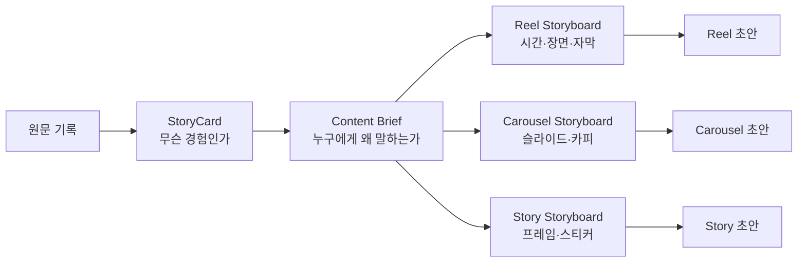
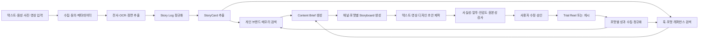

# 스토리로그 제품 기획 기준

- 제품명: 스토리로그(가칭)
- 기준일: 2026-08-16
- 문서 상태: 초기 제품 가설 및 구현 기준
- 목적: 서비스 방향, 콘텐츠 제작 파이프라인, AI/RAG 경계, MVP 범위와 검증 계획을 하나의 기준으로 정의한다.
- 전제: 시장·고객·채널 성과에 관한 내용은 가설이며 사용자 인터뷰와 실제 계정 데이터로 검증한다.

## 1. 서비스 정의

스토리로그는 사용자가 텍스트·음성·사진·영상으로 남긴 일상의 기록을 바탕으로, 그 사람의 실제 경험과 관점이 살아 있는 퍼스널 브랜딩 콘텐츠를 만들고 채널별 승인·게시·성과 학습까지 연결하는 AI 기록·콘텐츠 워크플로우다.

핵심 가치 제안은 다음과 같다.

> 오늘 있었던 일을 말하거나 남기기만 하면, 나의 관점이 살아 있는 콘텐츠 제작안이 생긴다.

첫 제품은 “AI 인플루언서 자동 운영 플랫폼”이 아니라 다음 약속에 집중한다.

> **나의 하루를 말로 남기면, 나다운 콘텐츠가 된다.**

### 1.1 해결하려는 문제

퍼스널 브랜딩을 원하는 예비 크리에이터와 전문가는 다음 문제를 겪는다.

1. 일상 중 무엇이 콘텐츠가 될 수 있는지 판단하기 어렵다.
2. 빈 화면에서 시작하는 부담 때문에 기록을 지속하기 어렵다.
3. 아이디어를 글·영상·카드뉴스로 편집하는 데 시간이 오래 걸린다.
4. 자신의 말투와 관점을 유지하면서 채널별 문법으로 바꾸기 어렵다.
5. 게시와 성과 확인이 분리되어 학습과 지속성이 떨어진다.
6. AI가 쓴 듯한 평준화된 문체나 과장된 내용은 개인의 신뢰를 훼손한다.

### 1.2 핵심 가설

사용자가 하루 1~3분 분량의 기록만 남기면 서비스가 콘텐츠 후보를 추출하고, 독자와 목적에 맞는 제작안을 제안하며, 사용자는 짧은 수정과 승인만으로 꾸준히 게시할 수 있을 것이다.

첫 출시에서 확인해야 할 것은 세 가지다.

1. 사용자가 빈 화면 앞에서 고민하는 대신 실제 기록을 남기는가?
2. AI가 기록에서 사용자가 “이건 내 이야기다”라고 느끼는 소재를 찾는가?
3. 사용자가 제작안을 신뢰하고 승인해 실제 채널에 게시하는가?

### 1.3 차별화 가설

차별화는 모델 자체나 게시 API가 아니라 다음 데이터의 누적에서 생긴다.

- 사용자의 실제 경험 로그
- 사용자가 중요하게 여기는 가치·관점·주제
- 승인·수정·거절한 콘텐츠와 수정 이유
- 채널·포맷별 성과와 사용자 선호
- 금지 표현·민감 주제·공개 범위
- 콘텐츠를 만들 때 효과가 있었던 훅·구조·CTA 패턴

초기에는 파인튜닝보다 **구조화된 브랜드 프로필 + 검색 가능한 개인 기록 + 승인 이력 + 검색 가능한 포맷 레퍼런스**를 우선한다. 데이터가 쌓인 뒤에도 검색·랭킹·프롬프트를 먼저 개선하고, 파인튜닝은 별도 평가셋으로 효과를 검증한다.

### 1.4 하지 말아야 할 것

- 경험에 없는 사실·수치·성과·감정을 만들어내지 않는다.
- 모든 채널에 동일한 콘텐츠를 복사하지 않는다.
- 외부 레퍼런스의 문장·장면·디자인을 그대로 복제하지 않는다.
- 사용자 승인 없이 공개 게시하지 않는다.
- 초기부터 완전 자동 운영을 약속하지 않는다.
- 조회수나 참여율만을 위해 자극성을 최적화하지 않는다.
- 성과가 높았다는 이유만으로 해당 표현을 사용자의 취향으로 단정하지 않는다.

## 2. 목표 사용자와 확장 순서

### 2.1 1차 타깃

AI·테크 분야의 예비 크리에이터와 전문직 개인을 우선한다.

- AI를 공부하거나 제품·서비스를 만드는 사람
- 경험과 관점을 공유하고 싶지만 꾸준히 쓰지 못하는 사람
- LinkedIn, X, Instagram 중 하나 이상을 운영하거나 시작하려는 사람
- 글감은 있지만 편집·포맷 변환·업로드에 시간을 쓰기 어려운 사람

이 도메인은 주제와 용어가 비교적 명확하고, 초기 사용자 인터뷰와 결과 품질 검증에 접근하기 쉽다는 가설을 가진다.

### 2.2 후속 타깃

- 마이크로 인플루언서가 되고 싶은 대학생·직장인
- 뷰티·라이프스타일·교육·창업 분야의 예비 크리에이터
- 여러 크리에이터의 제작을 돕는 에이전시·스튜디오

### 2.3 B2B2C 확장

- 출판사·영화사 등 IP 보유자
- 브랜드·광고주
- 크리에이터를 발굴하고 캠페인을 운영하는 마케팅 조직

B2B2C는 개인 서비스에서 기록 지속성·콘텐츠 품질·승인율이 검증된 뒤 확장한다. 사용자 로그를 광고주에게 넘기지 않으며 데이터 소유권, 활용 목적, 철회권, 익명화 기준을 별도 계약과 제품 설정으로 정의한다.

## 3. 핵심 도메인 개념

### 3.1 Story Log

텍스트·음성·사진·영상을 공통 포맷으로 정규화한 사용자의 경험 기록이다. 사건·사람·장소·시간·감정·인용 후보를 포함하며 모든 파생 결과가 원문 구간으로 돌아갈 수 있어야 한다.

### 3.2 StoryCard

StoryCard는 **어떤 경험을 콘텐츠로 만들지** 정리하는 소재 카드다. 제작 형식을 결정하는 문서가 아니다.

필수 정보:

```json
{
  "story_id": "st_123",
  "source_refs": [
    {"asset_id": "asset_123", "start_ms": 12000, "end_ms": 42000}
  ],
  "event": "AI 음성 에이전트를 테스트했다",
  "observation": "기술보다 질문 설계가 결과에 더 큰 영향을 줬다",
  "emotion": "의외였다",
  "opinion": "초기에는 모델 선택보다 질문 설계 실험이 우선이다",
  "evidence_level": "personal_observation",
  "sensitivity": "low",
  "content_angles": ["실험 회고", "실무 인사이트"]
}
```

사용자는 StoryCard에서 `나를 잘 표현함`, `사실 아님`, `과장됨`, `더 담백한 말투`와 같은 피드백을 남길 수 있어야 한다.

### 3.3 Content Brief

Content Brief는 **누구에게, 어떤 목적으로, 무엇을 전달할지** 정하는 콘텐츠 기획서다. StoryCard 한 개에서 목적이나 독자에 따라 여러 Brief가 나올 수 있다.

권장 필드:

```json
{
  "brief_id": "brief_123",
  "story_id": "st_123",
  "audience": "AI 도구를 막 도입한 제품 실무자",
  "objective": "저장과 프로필 방문",
  "core_message": "모델 선택 전에 질문 설계를 실험해야 한다",
  "proof_points": ["개인 테스트에서 질문 순서에 따라 답의 깊이가 달라졌다"],
  "hook_pattern": "반전·대조",
  "recommended_formats": ["reel", "carousel"],
  "tone": ["담백함", "실무적"],
  "cta_intent": "자신의 실험 방법을 댓글로 공유하게 한다",
  "reference_ids": ["hook_42", "format_reel_07"],
  "constraints": ["모델 성능에 대한 일반화 금지"]
}
```

### 3.4 Storyboard

Storyboard는 **실제 촬영·편집·디자인 전에 어떻게 보여줄지** 정하는 제작안이다. 하나의 Content Brief에서 Reel·Carousel·Story별 Storyboard가 각각 생성될 수 있다.

권장 필드:

```json
{
  "storyboard_id": "sb_123",
  "brief_id": "brief_123",
  "platform": "instagram",
  "format": "reel",
  "target_duration_seconds": 25,
  "hook": "좋은 AI를 찾느라 시간을 쓰고 있다면, 질문부터 바꿔보세요.",
  "beats": [
    {
      "order": 1,
      "start_ms": 0,
      "end_ms": 2000,
      "visual": "카메라 정면, 테스트 화면 빠른 컷",
      "voiceover": "결과를 바꾼 건 모델이 아니었습니다.",
      "on_screen_text": "모델보다 먼저 바꿀 것",
      "source_refs": ["asset_123#12000-16000"]
    }
  ],
  "caption_direction": "실험 배경과 한계를 짧게 보충",
  "cta": "여러분은 어떤 질문을 먼저 실험하나요?",
  "originality_notes": ["레퍼런스의 문구를 사용하지 않고 대조 구조만 활용"]
}
```

### 3.5 세 산출물의 관계



## 4. 전체 AI 워크플로우

자유형 자율 에이전트보다 입력·출력·실패 상태가 명확한 상태 기반 워크플로우를 사용한다. 오케스트레이션은 애플리케이션 코드가 담당하고 LLM 역할은 제한한다.



### 4.1 상태 정의

```text
CAPTURED
  -> TRANSCRIBED
  -> NORMALIZED
  -> STORY_MINED
  -> CONTEXT_RETRIEVED
  -> BRIEFED
  -> STORYBOARDED
  -> ASSET_DRAFTED
  -> QUALITY_CHECKED
  -> WAITING_FOR_APPROVAL
  -> APPROVED
  -> TEST_PUBLISHED | PUBLISHED
  -> MEASURED
```

각 상태는 DB에 저장한다. 장애 발생 시 마지막 성공 상태부터 재개하며, 게시 실패·사용자 수정 대기·토큰 만료·미디어 처리 대기도 정상 상태로 다룬다.

### 4.2 역할 경계

| 역할 | 책임 | 금지 사항 |
|---|---|---|
| `IntakeWorker` | 원본 저장, 동의·보존 정보 기록, 처리 예약 | 공개 여부를 임의 결정하지 않음 |
| `StoryMiner` | 원문에서 StoryCard 구조화 | 원문에 없는 사실 생성 금지 |
| `BrandContextRetriever` | 브랜드 프로필·승인 콘텐츠·경험 로그 검색 | 다른 사용자의 데이터 검색 금지 |
| `ReferenceRetriever` | 목적·주제·포맷에 맞는 훅·구조 검색 | 레퍼런스 문구·디자인 복제 금지 |
| `BriefPlanner` | 독자·목적·메시지·포맷 결정 | 근거 없는 성과 예측 금지 |
| `StoryboardPlanner` | 장면·슬라이드·자막·CTA 설계 | 출처 없는 장면이나 주장을 사실처럼 추가 금지 |
| `ContentProducer` | 채널·포맷별 초안 생성 | 원천 의미 변경 금지 |
| `QualityReviewer` | 사실성·말투·민감도·중복·원본성 검사 | 모델 점수만으로 게시 결정 금지 |
| `Publisher` | 승인·권한·토큰 검증 후 플랫폼 API 호출 | LLM이 직접 게시 API를 호출하지 않음 |

### 4.3 모델 호출 원칙

- 전사·분류·민감도 태깅은 비용과 지연시간이 낮은 모델을 사용한다.
- StoryCard 구조화와 Brief 생성은 구조화 출력이 안정적인 모델을 사용한다.
- Storyboard와 최종 카피는 표현 품질이 높은 모델을 사용한다.
- 사실성·정책·원본성 검사는 별도 모델과 규칙 기반 검사를 병행한다.
- 모델 응답은 JSON Schema로 검증한다.
- 원문·프롬프트 버전·모델 버전·비용·지연시간·결과·사용자 수정량을 실행 단위로 기록한다.
- 모델·전사·임베딩 공급자는 각각 어댑터로 분리한다.

## 5. RAG와 레퍼런스 라이브러리

개인화 RAG와 제작 레퍼런스 RAG는 목적과 신뢰 경계가 다르므로 논리적으로 분리한다.

### 5.1 개인 브랜드 메모리

1. **구조화 프로필**: 소개, 전문 분야, 가치, 목표 독자, 선호 채널, 말투, 금지 주제, 공개 범위
2. **승인 콘텐츠 라이브러리**: 최종 승인본, 수정 전후, 수정 이유, 채널·포맷
3. **경험 로그 인덱스**: 과거 Story Log와 StoryCard의 의미 검색

검색은 사용자 ID로 격리한 뒤 최신성·주제·채널·승인 여부로 필터링한다. 전체 기록을 프롬프트에 넣지 않고 현재 StoryCard에 필요한 근거만 `brand_context_bundle`로 제공한다.

### 5.2 훅 패턴

초기 레퍼런스 라이브러리는 다음 훅 패턴을 지원한다.

| 패턴 | 설명 | 예시 방향 |
|---|---|---|
| 특정 독자 호출 | 문제를 겪는 사람을 첫 문장에서 지목 | “AI 도구를 계속 바꾸고 있는 PM이라면” |
| 반전·대조 | 통념과 실제 경험의 차이를 제시 | “모델보다 질문이 결과를 더 바꿨다” |
| 실수·고백 | 실패나 오판을 솔직하게 공개 | “처음에는 비싼 모델이면 해결될 줄 알았다” |
| 전후 비교 | 변화 전후를 시각·수치·행동으로 비교 | 질문 변경 전/후 결과 비교 |
| 즉시 데모 | 설명 전에 결과나 사용 장면을 보여줌 | 1초 안에 답변 차이 노출 |
| 체크리스트 | 바로 적용할 수 있는 단계 제시 | “테스트 전 확인할 질문 3개” |
| 경험 서사 | 사건·갈등·발견·배움 순서로 전개 | 오늘의 실험에서 얻은 관점 |
| 질문·선택 | 독자가 자신의 입장을 고르게 함 | “모델과 질문 중 무엇을 먼저 바꾸나요?” |

훅은 문구 템플릿이 아니라 구조적 패턴으로 저장한다. 생성 결과가 레퍼런스와 문장·시각 구성이 지나치게 유사하면 원본성 검사에서 경고한다.

### 5.3 FormatTemplate

`FormatTemplate`은 채널·포맷별 제작 문법을 구조화한 데이터다.

```json
{
  "template_id": "fmt_ig_reel_demo_01",
  "platform": "instagram",
  "format": "reel",
  "name": "즉시 데모형 실험 회고",
  "objectives": ["discovery", "non_follower_reach"],
  "audience_conditions": ["초급 실무자"],
  "topic_tags": ["AI", "제품 실험"],
  "hook_patterns": ["즉시 데모", "반전·대조"],
  "constraints": {
    "duration_seconds": {"min": 15, "max": 30},
    "slide_count": null
  },
  "structure": [
    {"order": 1, "role": "hook", "duration_seconds": 2},
    {"order": 2, "role": "context", "duration_seconds": 4},
    {"order": 3, "role": "evidence_or_demo", "duration_seconds": 12},
    {"order": 4, "role": "takeaway", "duration_seconds": 5},
    {"order": 5, "role": "cta", "duration_seconds": 3}
  ],
  "visual_rules": ["첫 2초에 결과 화면 또는 얼굴을 노출"],
  "caption_rules": ["영상에서 생략한 실험 조건을 보충"],
  "cta_patterns": ["댓글 질문", "저장 유도"],
  "provenance": {
    "source_type": "curated_pattern",
    "source_ids": ["ref_123"]
  },
  "performance_baseline_id": "baseline_ig_reel_ai_small",
  "version": 1,
  "status": "active"
}
```

### 5.4 레퍼런스 데이터 운영

훅·포맷·Storyboard 레퍼런스는 다음 정보와 함께 저장한다.

- 출처 URL·수집일·작성자·플랫폼
- 사용 권한과 보존 정책
- 주제·언어·포맷·길이·훅 패턴·CTA
- 팔로워 규모 구간과 게시 시점
- 유기적/유료 여부
- 노출·조회·시청·저장·공유·댓글·팔로우 등 확보 가능한 지표
- 사람이 붙인 구조 태그와 품질 평가
- 원문 임베딩과 구조 요약 임베딩

약 2만 건의 보유 데이터는 바로 정답 데이터로 간주하지 않는다. 중복, 출처, 권리, 지표 정의, 누락값, 봇·광고 영향, 생존자 편향을 먼저 감사한 뒤 학습·검색·평가 용도를 구분한다.

검색·랭킹 시 팔로워 규모·주제·목적·포맷·게시 시점을 맞추고, 절대 조회수보다 동일 조건 내 정규화 점수를 우선한다.

```text
reference_score =
  semantic_relevance
  + objective_match
  + format_match
  + audience_size_match
  + normalized_performance
  + freshness
  - duplication_risk
  - provenance_risk
```

외부 레퍼런스는 표현 근거가 아니다. 개인의 사실과 주장은 반드시 사용자 원문 또는 확인된 브랜드 메모리에서만 가져온다.

## 6. Instagram 제작 전략

Instagram은 포맷별 목적과 사용자 행동이 다르다는 가설로 분리 설계한다. 특정 포맷이 항상 우월하다고 가정하지 않고 보유 데이터와 실제 계정 성과로 갱신한다.

### 6.1 포맷별 역할

| 포맷 | 우선 목적 | 적합한 내용 | 핵심 제작 단위 |
|---|---|---|---|
| Reel | 발견·비팔로워 도달·빠른 이해 | 데모, 전후 비교, 경험의 반전 | 시간대별 장면·음성·자막 |
| Carousel | 저장·공유·깊은 이해 | 체크리스트, 단계, 비교, 프레임워크 | 슬라이드별 주장·근거·시각화 |
| Story | 관계·피드백·실시간 맥락 | 진행 과정, 질문, 선택, 후속 공유 | 프레임·스티커·답변 유도 |

### 6.2 Reel Storyboard 기본 구조

25초 예시:

| 구간 | 역할 | 제작 지침 |
|---|---|---|
| 0~2초 | 훅 | 결과·반전·대상을 먼저 보여준다. 로고 인트로는 사용하지 않는다. |
| 2~6초 | 맥락 | 무엇을 테스트했고 왜 중요했는지 한 문장으로 설명한다. |
| 6~18초 | 근거·데모 | 원문 장면, 화면 녹화, 전후 비교로 핵심 관찰을 증명한다. |
| 18~23초 | 배움 | 개인 경험의 한계와 적용 가능한 결론을 구분한다. |
| 23~25초 | CTA | 저장·댓글·프로필 방문 중 목적 하나만 요청한다. |

Storyboard는 각 구간마다 `visual`, `voiceover`, `on_screen_text`, `source_refs`, `transition`, `risk_flags`를 가진다.

### 6.3 Carousel 기본 구조

| 슬라이드 | 역할 |
|---:|---|
| 1 | 특정 독자와 결과를 부르는 훅 |
| 2 | 문제 또는 실험 배경 |
| 3 | 일반적으로 했던 접근 |
| 4 | 예상과 달랐던 관찰 |
| 5~6 | 원문 근거·전후 비교·적용 방법 |
| 7 | 핵심 요약 또는 체크리스트 |
| 8 | 저장·공유·댓글 중 하나의 CTA |

슬라이드 한 장에는 핵심 주장 하나만 둔다. 캡션은 카드 내용을 반복하지 않고 실험 조건·한계·추가 맥락을 보충한다.

### 6.4 Story 기본 구조

3~5개 프레임을 기본으로 한다.

1. 지금 일어난 일 또는 상황
2. 원본 장면·감정·과정
3. 사용자의 관점이나 선택
4. 투표·질문·슬라이더 등 피드백 장치
5. 결과 공유 또는 Reel·Carousel 연결

Story의 목적은 완성된 정보 전달보다 관계와 피드백 수집에 둔다.

### 6.5 Trial Reel

지원되는 계정과 운영 조건에서는 사용자 승인 후 Trial Reel로 새로운 주제·훅·스토리텔링 형식을 비팔로워에게 먼저 시험하는 흐름을 제공할 수 있다.

```text
승인된 Reel
→ Trial Reel 가능 여부 확인
→ 비팔로워 테스트
→ 사전 정의한 관찰 기간 대기
→ 유지·수정·일반 게시 결정
→ 성과 데이터 저장
```

Trial Reel 지원 여부와 API 자동화 가능 범위는 계정·지역·플랫폼 정책에 따라 달라질 수 있으므로 핵심 MVP 성공 조건으로 두지 않는다. 지원되지 않으면 일반 승인 게시 또는 내보내기로 대체한다.

## 7. 품질·원본성·신뢰 기준

각 결과물은 1~5점으로 평가한다. 3점 미만이거나 필수 검사에 실패하면 게시 단계로 이동할 수 없다.

| 평가 항목 | 확인 질문 |
|---|---|
| 개인성 | 다른 사람이 그대로 쓸 수 없는 실제 경험·관찰이 있는가? |
| 사실성 | 원문에 없는 사실·수치·경력·감정을 만들지 않았는가? |
| 관점성 | 단순 요약이 아니라 사용자의 해석·선택·배움이 드러나는가? |
| 유용성 | 목표 독자에게 정보·생각거리·감정 중 하나를 제공하는가? |
| 말투 적합성 | 승인 이력과 브랜드 프로필에 가까운가? |
| 포맷 적합성 | 채널의 길이·구조·독자 기대와 Brief의 목적에 맞는가? |
| 근거 연결 | 주장·인용·장면이 원문 구간으로 추적되는가? |
| 원본성 | 레퍼런스 문구·장면·디자인을 지나치게 모방하지 않았는가? |
| 안전성 | 개인정보·명예훼손·저작권·민감 정보 위험이 낮은가? |
| 신선도 | 최근 콘텐츠와 지나치게 비슷하지 않은가? |

품질은 모델 점수만으로 결정하지 않는다. JSON Schema 검증, 원문 근거, 규칙 기반 검사, 유사도 검사, 사용자 승인, 수정량과 게시 후 이력을 함께 사용한다.

필수 실패 조건의 예:

- 원문 또는 확인된 메모리에 없는 핵심 주장
- 타인의 개인정보·얼굴·음성에 대한 공개 동의 불명확
- 레퍼런스와 높은 문장·장면 유사도
- 금지 주제 또는 공개 범위 위반
- 필수 미디어 권리 정보 누락

## 8. 사용자 경험

### 8.1 홈: 오늘의 기록

- `말로 남기기`, `글로 남기기`, `사진·영상 추가`
- 빈 입력창 대신 질문 카드 제공
  - 오늘 새로 알게 된 것은?
  - 예상과 달랐던 것은?
  - 누군가에게 말해 주고 싶은 것은?
  - 오늘의 선택에서 배운 것은?
- 최근 기록과 콘텐츠화하지 않은 StoryCard 표시

### 8.2 StoryCard 화면

- 제목 후보와 원문 핵심 구간
- 사실·관찰·감정·의견·배움 구분
- 공개 위험 요소와 근거 수준
- 추천 콘텐츠 각도
- 사용자 피드백과 수정
- `Content Brief 만들기` CTA

### 8.3 Content Brief 화면

- 목표 독자·목적·핵심 메시지
- 근거와 금지 조건
- 추천 훅 패턴과 선택 이유
- 추천 포맷과 예상되는 사용자 행동
- Brief 수정·확정

### 8.4 Storyboard 화면

StoryCard와 Storyboard가 시각적으로 혼동되지 않게 분리한다.

- 왼쪽: 원문과 StoryCard 근거
- 가운데: 확정된 Content Brief
- 오른쪽: 포맷별 Storyboard
- Reel은 타임라인, Carousel은 슬라이드 목록, Story는 프레임 흐름으로 표시
- 각 제작 단위에서 원문·AI 재구성·검토 필요·레퍼런스 패턴을 구분
- 모바일·데스크톱에서 `MVP`와 `Scale` 범위를 전환해 볼 수 있는 기획 뷰 제공

### 8.5 승인·게시 화면

- 포맷별 미리보기
- 원문 근거와 원본성 검사 결과
- 게시 시점·공개 범위·민감 표현 확인
- `승인 후 게시` 단일 CTA
- Trial Reel 가능 여부와 일반 게시 대안
- 게시 결과·오류·재시도 안내

## 9. 데이터 모델

| 엔터티 | 핵심 필드 |
|---|---|
| `User` | id, login_provider, consent_status, locale, created_at |
| `BrandProfile` | user_id, bio, topics, values, audience, tone, taboo_topics, visibility_rules |
| `SourceAsset` | user_id, type, storage_url, captured_at, retention_until, consent_scope, rights_metadata |
| `Transcript` | asset_id, text, segments, confidence, language |
| `StoryCard` | source_refs, event, observation, emotion, opinion, evidence_level, sensitivity, status |
| `ContentBrief` | story_id, audience, objective, core_message, proof_points, hook_pattern, formats, constraints |
| `FormatTemplate` | platform, format, objective, structure, rules, provenance, baseline, version |
| `ReferenceItem` | source, creator, rights, tags, embeddings, metrics, normalized_score |
| `Storyboard` | brief_id, platform, format, hook, beats_or_slides, caption_direction, cta, originality_notes |
| `ContentDraft` | storyboard_id, channel, copy, media_refs, prompt_version, model_version |
| `Review` | draft_id, user_action, edits, issue_flags, reviewed_at |
| `Publication` | draft_id, channel, account_id, mode, status, external_id, published_url, error_code |
| `MetricSnapshot` | publication_id, captured_at, reach, views, watch_time, likes, comments, shares, saves, follows |

원천 자료에서 최종 게시물까지 연결을 유지한다. 사용자가 “이 문장·장면은 어디서 나왔나요?”를 확인할 수 있어야 하며 원본 삭제 요청 시 파생 데이터 처리 정책도 함께 실행한다.

## 10. 개인정보·보안·권한

- 원본 파일, 전사, StoryCard, Brief, Storyboard, 게시물을 분리 저장한다.
- 각 데이터의 공개 범위·보존 기간·처리 동의를 기록한다.
- 타인의 얼굴·목소리·대화가 포함되면 업로드와 공개 전에 안내한다.
- 주소·전화번호·이메일·고유식별정보 등 개인정보 후보를 탐지한다.
- 개인 브랜드 메모리와 벡터 검색은 사용자별로 격리한다.
- 플랫폼 토큰은 서버의 암호화 저장소에 보관한다.
- 게시·삭제·토큰 변경·데이터 내보내기를 감사 로그로 남긴다.
- 모델 공급자의 입력 보존·학습 사용·지역 저장·삭제 옵션을 계약 전에 확인한다.
- 외부 레퍼런스는 수집 근거·사용 권한·삭제 요청 처리 방법을 보관한다.

## 11. 포맷별 성과와 학습

단순 조회수나 참여율 하나로 모든 포맷을 평가하지 않는다.

| 포맷 | 우선 KPI | 보조 KPI |
|---|---|---|
| Reel | 비팔로워 도달, 초반 유지, 평균 시청 시간, 완료율 | 공유, 프로필 방문, 도달 1천 회당 팔로우 |
| Carousel | 도달 1천 회당 저장·공유 | 참여, 프로필 방문, 팔로우 |
| Story | 프레임 완료율, 이탈률, 답장 | 스티커 탭, 링크 탭, 다음 콘텐츠 이동 |

성과 비교 시 다음 조건을 정규화한다.

- 팔로워 규모 구간
- 주제·언어·국가
- 콘텐츠 목적
- 포맷·길이·슬라이드 수
- 유기적/유료 배포
- 게시 후 경과 시간
- 기존 팔로워/비팔로워 노출 비중

성과는 다음 추천의 하나의 신호로만 사용한다. 사용자의 직접 평가와 브랜드 원칙이 성과 최적화보다 우선한다.

## 12. MVP와 Scale 범위

### 12.1 MVP

핵심 가설인 `기록 → 나다운 소재 → 제작 가능한 초안 → 승인`을 검증한다.

- 텍스트 입력과 음성 파일 업로드 또는 앱 내 녹음
- 원문·전사·StoryCard 확인
- 초기 브랜드 프로필과 승인 콘텐츠 검색
- StoryCard → Content Brief
- Instagram Reel·Carousel·Story용 기본 FormatTemplate
- Content Brief → 포맷별 Storyboard
- 원문 근거와 함께 Storyboard·초안 검토
- 수정·승인·거절
- 복사·다운로드와 우선순위 채널 1개 게시
- 게시 이력과 기본 포맷별 성과
- 원본·파생 콘텐츠 삭제와 데이터 내보내기

MVP에서 제외:

- 실시간 전화 자동 발신
- 목소리 복제
- 승인 없는 완전 자동 게시
- DM 자동 응답
- 자동 고급 영상·디자인 편집기
- 팀 워크스페이스
- 광고주·IP 보유자 매칭
- 고급 광고 성과 분석

### 12.2 Scale

- 사진·영상의 장면·화자·OCR 고도화
- 대규모 훅·포맷·Storyboard 레퍼런스 검색
- 계정·주제·포맷별 성과 랭킹
- 생성 미디어와 반자동 편집
- Trial Reel 실험 자동화가 허용되는 범위의 운영 보조
- LinkedIn·X·Instagram·YouTube 다중 채널 예약 게시
- 에이전시용 다중 브랜드 승인 흐름
- B2B2C 캠페인과 동의 기반 크리에이터 매칭

## 13. 성공 지표와 제품 실험

### 13.1 핵심 지표

**주간 승인 콘텐츠 수 / 주간 활성 사용자**를 1차 핵심 지표로 둔다.

초기 목표는 확정 KPI가 아니라 첫 4주 실험에서 조정할 가설이다.

| 영역 | 지표 | 초기 가설 |
|---|---|---:|
| 활성화 | 가입 후 첫 기록 완료율 | 60% 이상 |
| 속도 | 첫 기록에서 첫 제작안까지 | 5분 이내 |
| 소재 품질 | StoryCard를 “내 이야기”로 평가한 비율 | 측정 후 기준 설정 |
| 승인 | 생성 후 사용자가 승인한 비율 | 40% 이상 |
| 신뢰 | 사실성 문제로 거절된 비율 | 5% 이하 |
| 지속성 | 7일 내 두 번째 기록 완료율 | 30% 이상 |
| 게시 | 승인 후 게시 또는 다운로드 비율 | 50% 이상 |
| 사용성 | 승인본의 평균 수정량 | 반복 사용 시 감소 |
| 비용 | 기록 1건당 AI 처리 비용 | 미디어 길이·포맷별 측정 |

### 13.2 우선 실험

1. **입력 장벽**: 빈 입력창 vs 질문형 텍스트 vs 1분 음성
2. **개인화 원천**: 일반 프롬프트 vs 브랜드 프로필 vs 브랜드 프로필+승인본+원문 근거
3. **기획 계층의 가치**: StoryCard에서 바로 생성 vs Brief 확인 후 생성 vs Brief+Storyboard 확인 후 생성
4. **포맷 추천**: 고정 포맷 vs 목적 기반 추천 vs 개인 성과 기반 추천
5. **게시 자동화**: 초안만 제공 vs 승인 후 게시 vs 충분한 신뢰 형성 후 예약 게시
6. **Trial Reel**: 일반 게시와 비교해 새로운 주제 검증에 유용한지 확인

### 13.3 평가셋

동의한 초기 사용자 20~30명의 실제 기록과 승인본으로 다음 평가셋을 만든다.

- 원문 → 좋은/나쁜 StoryCard
- StoryCard → 좋은/나쁜 Content Brief
- Brief → 실행 가능한/불가능한 Storyboard
- 원문 근거가 없는 환각 사례
- 사용자별 선호 말투와 거절 표현
- 레퍼런스와 지나치게 유사한 결과
- 채널·포맷별 승인본과 거절본
- 민감 정보·타인 정보·권리 불명확 사례

## 14. 출시 로드맵

### Phase 0: 문제 검증 — 1~2주

- AI·테크 예비 크리에이터 10~15명 인터뷰
- 최근 일주일의 기록과 제작 과정을 관찰
- 입력·기획·제작·게시 중 가장 큰 마찰 확인
- 수작업으로 기록 1개를 StoryCard·Brief·세 포맷 Storyboard로 변환해 가치 테스트

### Phase 1: 기록 → StoryCard — 2~3주

- 텍스트·음성 입력과 전사
- Story Log 정규화와 StoryCard 추출
- 브랜드 프로필·승인 이력 저장
- 원문 근거·삭제 기능

### Phase 2: StoryCard → Brief → Storyboard — 2~3주

- 훅·포맷 레퍼런스 검색
- Content Brief 생성·수정
- Instagram Reel·Carousel·Story Storyboard
- 품질·원본성 검사와 승인
- 프롬프트·모델·비용 로그

### Phase 3: 제작안 → 게시·성과 — 2~4주

- 채널용 텍스트·미디어 초안
- OAuth 계정 연결
- 우선순위 채널 1개 게시
- 게시 상태·오류 재시도·중복 방지
- 포맷별 기본 성과 수집

### Phase 4: 지속성·확장

- 정기 체크인과 실시간 음성 대화
- 영상 하이라이트·자막·디자인 보조
- 대규모 레퍼런스 랭킹
- Trial Reel과 다중 채널 실험
- 에이전시·B2B2C 확장

## 15. 주요 리스크

| 리스크 | 영향 | 대응 |
|---|---|---|
| AI가 사실·감정을 과장 | 신뢰·평판 피해 | 원문 근거, 구조화 출력, 검수, 승인 |
| 결과가 비슷한 AI 문체로 수렴 | 차별화 실패 | 승인본 검색, 말투 프로필, 수정 이유 반영 |
| 레퍼런스 모방 | 저작권·브랜드 신뢰 문제 | 패턴만 검색, 출처 관리, 유사도·원본성 검사 |
| 2만 건 데이터의 품질·권리 불명확 | 잘못된 추천·법적 위험 | 데이터 감사, 용도 분리, provenance 필수화 |
| 타인의 개인정보 포함 | 법적·윤리적 문제 | 탐지·경고·동의·접근 통제·삭제 |
| 플랫폼 정책·API 변경 | 게시·Trial 흐름 중단 | 어댑터 분리, 내보내기 제공, 출시 전 재확인 |
| 실시간 미디어 비용 증가 | 원가 악화 | 비동기 처리, 길이 제한, 모델 라우팅 |
| 기록 지속성 부족 | 리텐션 저하 | 질문형 체크인, 기록 재활용, 주간 묶음 |
| 성과 최적화의 자극성 편향 | 브랜드 훼손 | 개인성·사실성·유용성 가중치, 사용자 원칙 우선 |
| 원본 로그 과다 보관 | 보안·규제 부담 | 보존 기간, 삭제·내보내기, 데이터 최소화 |

## 16. 수익모델 가설

### 16.1 개인·스튜디오 유료 검증

- 개인 구독: 기록 처리량·음성 분량·제작 포맷·채널 수 기준
- 크리에이터 스튜디오/에이전시 파일럿: 여러 브랜드 프로필과 승인 워크플로우
- 초기에는 수작업 온보딩을 포함한 소수 유료 파일럿

### 16.2 B2B2C

- 브랜드가 캠페인 목적과 타깃을 입력
- 동의한 크리에이터를 주제·관심·활동 기준으로 매칭
- Brief·Storyboard·검토·게시·성과를 캠페인 단위로 관리

사용자 로그 원문을 광고주에게 제공하지 않는다. 활용 목적·공개 범위·철회권·익명화 기준을 명시한다.

## 17. 의사결정이 필요한 열린 항목

- 첫 유료 사용자의 구체적인 직업·콘텐츠 목적
- MVP에서 우선 제작할 Instagram 포맷과 첫 게시 채널
- StoryCard·Brief·Storyboard 중 사용자가 반드시 확인해야 할 단계
- 약 2만 건 레퍼런스 데이터의 출처·권리·지표 품질
- 임베딩·생성·전사 모델 공급자와 데이터 보존 조건
- Trial Reel의 계정별 지원 범위와 운영·API 자동화 가능성
- 원본과 파생 데이터의 기본 보존 기간
- 사실성·원본성 검사 실패 임계값
- 가격에 포함할 기록 길이·포맷 수·채널 수

